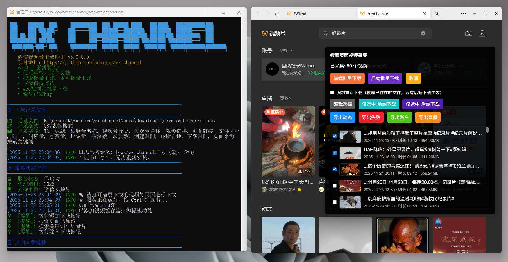
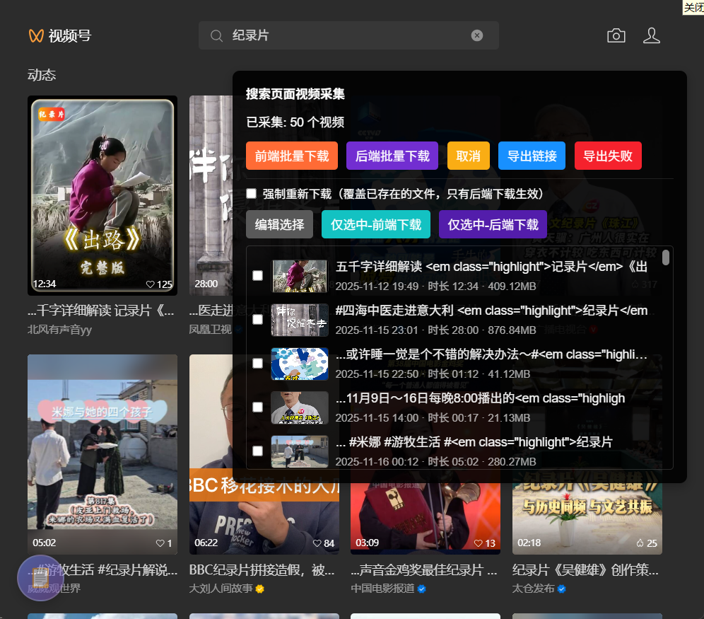

# 微信视频号下载助手

**WX Channel Downloader** - 一个简单易用的微信视频号下载工具

<p align="center">
    <a href="https://github.com/nobiyou/wx_channel"></a>
    <a href="https://github.com/nobiyou/wx_channel/issues"></a>
    <a href="https://github.com/nobiyou/wx_channel/blob/master/LICENSE"></a>
    <br>
    
    
    
</p>

---

微信视频号下载助手是一个基于 Go 与 SunnyNet 的本地 HTTP 代理工具，用于拦截微信视频号网页流量并进行脚本注入与本地交互。通过零配置、一键启动的方式，让您在几分钟内开始下载和管理视频号内容。



## 近期更新计划

加入搜索批量下载功能以及评论的获取，看难度，难度太难进度会缓慢些。~~在看代码了，js都是加密的，难度有些大。~~

已经完成搜索批量下载的功能，还在测试，没有问题了会在几天后更新。



## 功能特性

- **简单安装**：下载即用，无需复杂配置，几分钟内即可开始使用
- **自动注入**：自动在视频号页面注入友好的操作界面，无需手动操作
- **批量下载**：支持单个和批量下载，可选择下载或全量下载
- **智能去重**：自动去重，避免重复下载，节省存储空间
- **分片上传**：大文件采用分片上传，支持断点续传
- **加密支持**：支持加密视频的下载和解密
- **多格式导出**：支持导出视频链接为 TXT、JSON、Markdown 格式
- **下载记录**：自动记录所有下载信息到 CSV 文件，便于管理
- **文件组织**：按作者自动分类保存视频文件
- **日志系统**：完整的日志记录，支持文件大小滚动

## 系统要求

- **操作系统**：Windows 10+
- **Go 环境**：1.23+（仅当需要从源码编译时）
- **浏览器**：微信浏览器
- **网络**：能够访问微信视频号网站
- **权限**：建议以管理员身份运行（用于证书自动安装）

## 安装

### 方式一：使用预编译版本（推荐）

1. 访问 [GitHub Releases](https://github.com/nobiyou/wx_channel/releases)
2. 下载对应操作系统的最新版本
3. 解压到任意目录
4. 运行可执行文件

### 方式二：从源码编译

```bash
# 克隆仓库
git clone https://github.com/nobiyou/wx_channel.git
cd wx_channel

# 基本编译
go build -o wx_channel.exe

# 优化体积编译（推荐）
go build -ldflags="-s -w" -o wx_channel_mini.exe
```

## 快速开始

1. **启动程序**
   ```bash
   # Windows
   wx_channel.exe
   ```

2. **配置浏览器代理**
   - 进入面板查看服务状态
   - 查看代理端口

3. **安装证书**
   - 程序首次运行时会自动尝试安装根证书
   - 如果自动安装失败，手动安装 `downloads/SunnyRoot.cer`
   - 安装后重新打开视频号

4. **开始使用**
   - 打开微信视频号页面
   - 使用注入的前端面板进行下载
   - 支持单个下载、批量下载、选择下载等多种方式
   - 详细使用说明请参考 [下载视频文档](docs/DOWNLOADMOVIE.md)

## 配置

### 命令行参数

```bash
wx_channel.exe --help                 # 显示帮助信息
wx_channel.exe -v, --version          # 显示版本信息
wx_channel.exe -p, --port <端口>      # 指定代理端口（默认 2025）
wx_channel.exe --uninstall            # 卸载根证书
```

### 环境变量

```bash
# 代理端口
WX_CHANNEL_PORT=2025

# 下载目录
WX_CHANNEL_DOWNLOADS_DIR=downloads

# 安全配置
WX_CHANNEL_TOKEN=your_secret_token                    # 本地授权令牌
WX_CHANNEL_ALLOWED_ORIGINS=https://example.com        # Origin 白名单

# 日志配置
WX_CHANNEL_LOG_FILE=logs/wx_channel.log               # 日志文件路径
WX_CHANNEL_LOG_MAX_MB=5                               # 日志文件最大大小（MB）

# 并发配置
WX_CHANNEL_UPLOAD_CHUNK_CONCURRENCY=4                 # 分片上传并发数
WX_CHANNEL_DOWNLOAD_CONCURRENCY=2                     # 批量下载并发数
```

更多配置选项请参考 [配置文档](docs/CONFIGURATION.md)。

## 文档

完整的文档可在 [docs](docs/) 目录下找到：

- [介绍](docs/INTRODUCTION.md) - 项目概述和功能说明
- [安装指南](docs/INSTALLATION.md) - 详细的安装和配置步骤
- [配置概览](docs/CONFIGURATION.md) - 所有配置选项说明
- [下载视频](docs/DOWNLOADMOVIE.md) - 下载视频及相关说明
- [故障排除](docs/TROUBLESHOOTING.md) - 常见问题解决方案
- [常见问题](docs/COMMON_ISSUES.md) - 快速问题解答
- [优化记录](docs/OPTIMIZATION.md) - 项目优化历程

## 工作原理

1. **代理拦截**：程序启动本地 HTTP 代理服务器，拦截微信浏览器流量
2. **脚本注入**：自动在微信视频号页面注入 JavaScript 脚本
3. **信息采集**：脚本采集视频信息并通过 API 发送到本地服务
4. **文件保存**：本地服务接收视频数据并保存到指定目录
5. **记录管理**：所有下载记录自动保存到 CSV 文件

## 目录结构

```
wx_channel/
├── downloads/                    # 下载目录
│   ├── download_records.csv      # 下载记录
│   ├── .uploads/                 # 分片上传临时目录
│   └── <作者名>/                 # 按作者分类的视频文件
├── logs/                         # 日志目录
│   └── wx_channel.log            # 日志文件
├── docs/                         # 文档目录
├── internal/                     # 内部包
│   ├── config/                   # 配置管理
│   ├── handlers/                 # API 处理器
│   ├── services/                 # 服务层
│   ├── storage/                  # 存储管理
│   └── utils/                    # 工具函数
├── inject/                       # 前端注入脚本
├── lib/                          # 静态资源
└── main.go                       # 主程序入口
```

## 故障排除

遇到问题？请查看 [故障排除文档](docs/TROUBLESHOOTING.md) 或 [常见问题](docs/COMMON_ISSUES.md)。

如需帮助，可以：
- 提交 [GitHub Issue](https://github.com/nobiyou/wx_channel/issues)
- 查看 [文档](docs/)

## 更新日志

所有版本的更新记录可在 [GitHub Releases](https://github.com/nobiyou/wx_channel/releases) 页面查看。

### 最新版本（v20251108）

- **UI/UX 优化**：状态信息栏、自定义确认对话框
- **批量下载**：支持前端和后端批量下载，支持选择下载
- **多格式导出**：支持 TXT、JSON、Markdown 格式
- **加密支持**：支持加密视频的前缀解密
- **日志系统**：默认开启，支持文件大小滚动
- **性能优化**：分片上传并发控制、CSV 去重优化

## 支持项目

如果本项目对你有帮助，欢迎扫码赞赏，支持后续维护与迭代：

  

### 赞赏名单

| 日期       | 昵称      | 金额 | 留言                     |
| ---------- | --------- | ---- | ------------------------ |
| 2025-09-30 | 潘*君 | ￥5.00   | 未留言 |
| 2025-10-12 | 三*家 | ￥5.00   | 请大佬喝杯饮料 |
| 2025-10-31 | wang***yu | ￥1.00   | 真棒 |
| 2025-11-01 | 倪*孔 | ￥20.00   | 自动下载增加暂停？已下载跳过？（新版本已经解决详细看文档） |
| 2025-11-03 | 清***工作室 | ￥1.00   | 你可是太牛逼了 |
| 2025-11-05 | 李*辰 | ￥5.00   | 有群吗 v:****（个人微信：tutuixiu） |
| 2025-11-10 | 我**我在 | ￥1.00   | 希望可以一键批量下载某视频号特定时间范围内的所有视频（视频<br>号没有这样的接口，等视频号有这样的功能了我弄上，有其他疑问<br>可以看文档，文档内容还是很丰富的，整理了很久） |
| 2025-11-17 | 方* | ￥100.00   | 加油，真心感谢您的付出，谢谢！（感谢赞赏，功能也在慢慢的添<br>加中，目前在弄的是搜索批量下载和评论保存） |

> 欢迎在赞赏备注中写下昵称与留言，收到后会及时更新名单。

## 许可证

本项目采用 [MIT License](LICENSE) 许可证。

## 致谢

- [SunnyNet](https://github.com/qtgolang/SunnyNet) - HTTP/HTTPS 代理库
- [Go](https://golang.org/) - 编程语言

## 免责声明

本工具仅供学习和研究使用。请遵守相关法律法规，尊重内容创作者的版权。使用本工具下载的内容请勿用于商业用途或非法传播。

---

<p align="center">
    Made with ❤️ by <a href="https://github.com/nobiyou">nobiyou</a>
</p>
