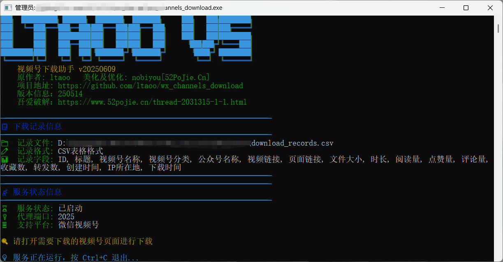

# 微信视频号下载工具

软件的初始来之作者的开源项目
<br/>
https://github.com/ltaoo/wx_channels_download

致敬作者，感谢作者开源的项目。软件界面加了大字立体。


在视频下方的操作按钮一栏，会多出一个下载按钮，如下所示


> 如果没有，可以看看「更多」这里是否有「下载视频」按钮。只有视频详情页才有按钮，否则失败。

视频时长过长容易下载失败，加了缓存进度显示提醒。


缓存成功后会有明显的提醒，即可对长视频进行下载。


<br>

不同视频这里显示的选项是不同的，下面是不同视频格式参数对比：

|    文件名  |   分辨率    |  标识符  | 大小(MB) | 总比特率 | 帧速率 | 音频采样率 | 音频比特率 | 时长  |
| --- | --- | --- | --- | --- | --- | --- | --- | --- |
|               ..._WT112_1024x576.mp4                | 1024x576  | WT112 | 18.07  | 2116 Kbps  | 30.000 fps | 44100 Hz | 128 Kbps | 71.61 秒 |
|               ..._WT113_1024x576.mp4                | 1024x576  | WT113 | 14.13  | 1655 Kbps  | 30.000 fps | 44100 Hz | 128 Kbps | 71.61 秒 |
|               ..._WT114_1024x576.mp4                | 1024x576  | WT114 | 11.08  | 1298 Kbps  | 30.000 fps | 44100 Hz | 128 Kbps | 71.61 秒 |
|               ..._WT157_1024x576.mp4                | 1024x576  | WT157 | 14.37  | 1683 Kbps  | 30.000 fps | 44100 Hz | 128 Kbps | 71.61 秒 |
|               ..._WT158_1024x576.mp4                | 1024x576  | WT158 | 11.68  | 1368 Kbps  | 30.000 fps | 44100 Hz | 128 Kbps | 71.61 秒 |
|               ..._WT159_1024x576.mp4                | 1024x576  | WT159 |  9.44  | 1105 Kbps  | 30.000 fps | 44100 Hz | 128 Kbps | 71.61 秒 |
|               ..._WT111_1280x720.mp4                | 1280x720  | WT111 | 23.39  | 2740 Kbps  | 30.000 fps | 44100 Hz | 128 Kbps | 71.61 秒 |
|               ..._WT156_1280x720.mp4                | 1280x720  | WT156 | 18.44  | 2160 Kbps  | 30.000 fps | 44100 Hz | 128 Kbps | 71.61 秒 |
| 原始视频 | 1920x1080 |  原始视频  | 130.04 | 15232 Kbps | 60.000 fps | 44100 Hz | 128 Kbps | 71.61 秒 |

## 5.18版本更新：
更改顶部文字“ltaoo v5”，致敬作者；加了下载保存记录表格功能，下载都放上，大家自己挑。

## 5.19版本更新：
增加保存下载视频记录为表格，便于记录

## 5.25版本更新：
增加保存运营数据功能，包括公众号信息，视频发布ip，点赞、收藏、转发等数据。

## 6.9版本更新：
增加缓存提醒功能，长视频需要缓存（可以主动点击进度条进行缓存，切莫跳着点）。

## 常见问题

1、服务启动了，打开视频详情后一直在加载，而且终端没有日志信息。
<br/>
尝试在终端 `Ctrl+C`，按一次即可。

2、解密失败，停止下载
<br/>
关闭全部视频页面、窗口。重新打开，就可以下载。

## 开发说明

先以 管理员身份 启动终端，然后 `go run main.go` 即可。

## 打包

```bash
go build -o wx_channels.exe
go build -ldflags="-s -w" -o wx_channels_download.exe
```

打包后可以使用 `upx` 压缩，体积可以从 21MB 压缩到 9MB。

## 其他

此程序大部分参考自以下项目代码
<br/>
https://github.com/kanadeblisst00/WechatVideoSniffer2.0
<br/>
https://github.com/ltaoo/wx_channels_download

此程序的核心实现依赖以下库
<br/>
https://github.com/qtgolang/SunnyNet

## 我的赞赏码

如果我的项目对你有所帮助，可以请我喝杯咖啡 ☕️

