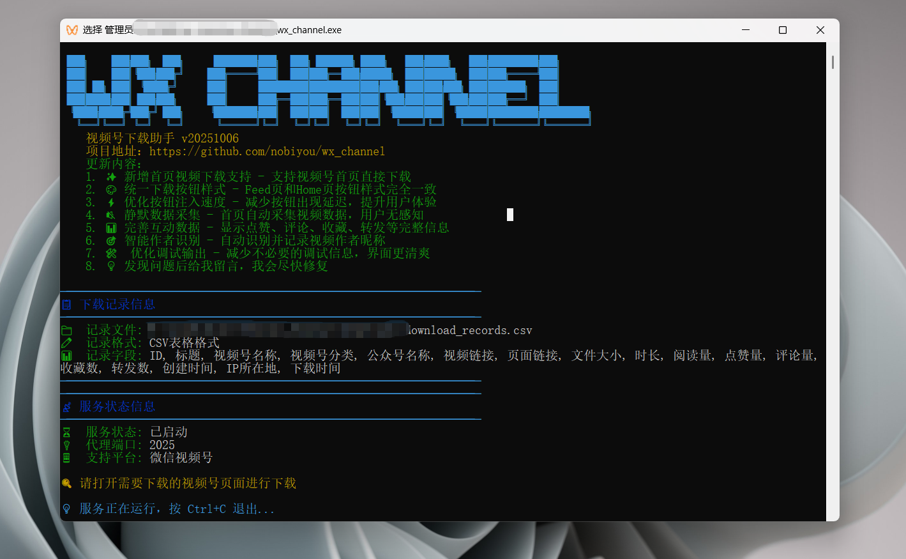
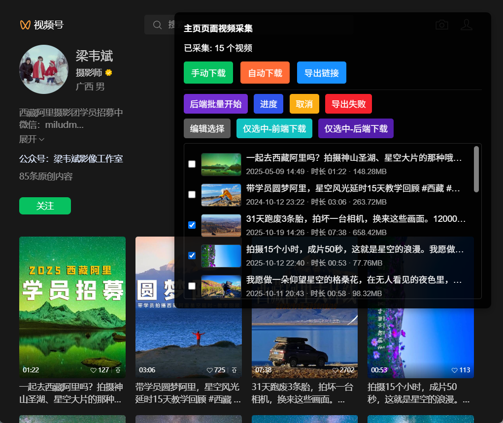
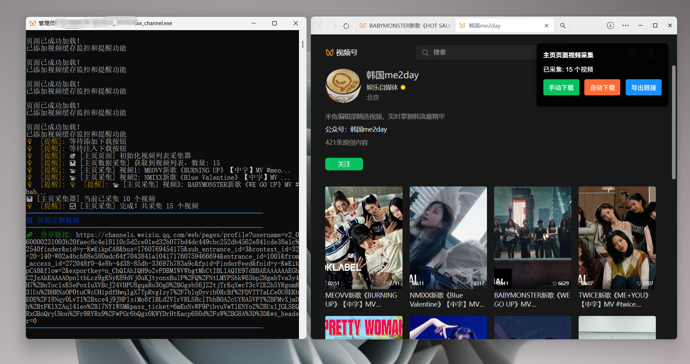
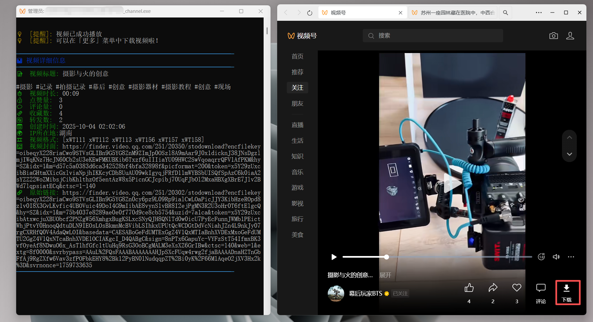
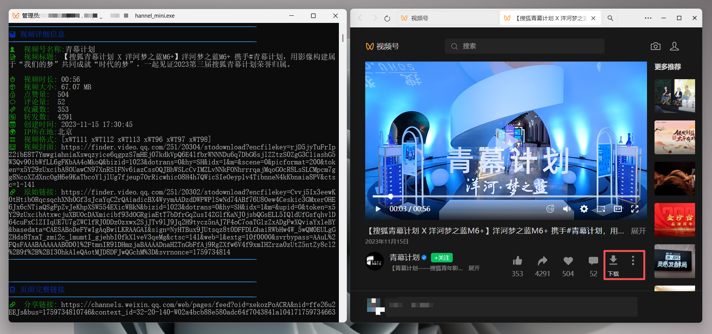
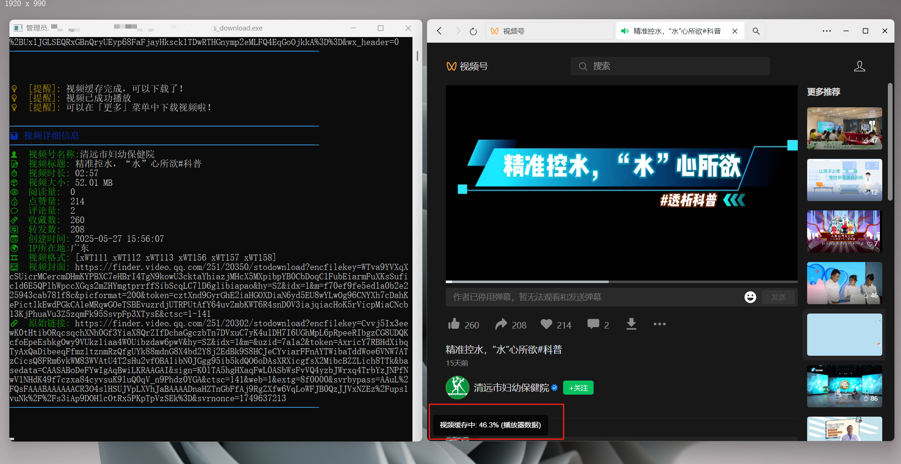
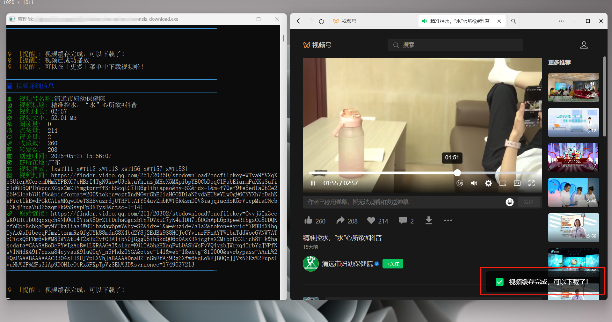

# 微信视频号下载工具

## 项目介绍

本项目是一个用于下载微信视频号内容的工具，基于[ltaoo的开源项目](https://github.com/ltaoo/wx_channels_download)进行功能扩展和界面优化。在此特别致敬原作者，感谢其开源贡献。



### 勾选下载功能已在重构beta版上线，大家先用，有问题了反馈，下载也分前端下载和后端下载，功能略有差异，也需要看大家喜欢哪种或者两种都保留。


### 重要提醒：软件启动要用管理员权限，要安装证书才可以。


## 主要功能

### 批量下载
- **📦 主页批量下载**: 支持主页视频列表批量采集和下载
- **🔄 手动下载**: 使用浏览器原生下载对话框，用户可自选保存位置
- **🤖 自动下载**: 静默下载到软件目录，自动按作者分类存储
- **📊 实时进度**: 批量下载进度显示，成功/失败统计
- **📋 链接导出**: 一键导出所有视频URL，方便外部工具下载

### 分片上传
- **✂️ 智能分片**: 自动将视频分割为2MB小块上传
- **🔄 断点续传**: 支持上传中断后从断点继续
- **⚡ 稳定性**: 避免大文件上传超时失败
- **🎯 智能重试**: 上传失败自动重试，最多3次

### 单个下载
- **✨ 首页下载支持**: 支持视频号首页直接下载，无需跳转详情页
- **🎨 统一样式**: Feed页和Home页下载按钮样式完全一致
- **⚡ 快速响应**: 优化按钮注入速度，减少等待时间
- **🔐 自动解密**: 自动解密加密视频，确保视频可正常播放

### 数据功能
- **🔇 静默采集**: 首页自动采集视频数据，用户无感知
- **📊 完整数据**: 显示点赞、评论、收藏、转发等完整互动信息
- **🎯 智能识别**: 自动识别并记录视频作者昵称和地理位置
- **📹 视频参数**: 采集分辨率、码率、编码格式等技术参数
- **💾 数据导出**: 保存下载记录和运营数据为表格

### 系统功能
- **🛠️ 清爽界面**: 优化调试输出，界面更简洁
- **🗂️ 智能分类**: 按作者自动创建文件夹分类存储
- **🔖 文件命名**: 自动添加发布时间前缀，避免重名覆盖
- **📝 CSV记录**: 记录每次下载的详细信息到CSV文件

## 使用指南

### 证书安装

#### Windows 11 证书安装失败
如果遇到证书安装错误（如 "Import-Certificate denied"），请按以下步骤解决：

**方法1：以管理员身份运行（推荐）**
1. 右键点击程序图标
2. 选择"以管理员身份运行"
3. 重新启动程序

**方法2：手动安装证书**
1. 程序会自动将证书文件保存到 `downloads/SunnyRoot.cer`
2. 双击证书文件
3. 选择"安装证书"
4. 选择"本地计算机"
5. 选择"将所有的证书都放入下列存储"
6. 选择"受信任的根证书颁发机构"
7. 点击"确定"完成安装

**方法3：忽略证书安装**
- 无法开启代理，不能注入，程序无法使用

#### 其他系统证书问题
- **macOS**: 双击证书文件，在钥匙串访问中设置为"始终信任"
- **Linux**: 根据发行版不同，可能需要手动导入证书

### 卸载程序

#### 完全卸载
1. **卸载证书**：
   ```bash
   wx_channel.exe --uninstall
   ```
   
2. **删除程序文件**：
   - 删除程序可执行文件
   - 删除 `downloads` 目录（包含下载的视频和记录）
   - 删除 `certs` 目录（包含证书文件）

3. **清理系统设置**：
   - 在系统代理设置中关闭代理
   - 重启浏览器

#### 仅卸载证书
如果只想卸载证书但保留程序：
```bash
wx_channel.exe --uninstall
```

#### 手动卸载证书
如果自动卸载失败，可以手动删除：
- **Windows**: 打开"证书管理器" → "受信任的根证书颁发机构" → 找到"SunnyNet"证书并删除
- **macOS**: 打开"钥匙串访问" → 找到"SunnyNet"证书并删除

### 下载视频

#### 方式一：主页批量下载（推荐）⭐
1. 打开微信视频号的个人主页（非详情页）
2. 程序会自动采集页面上所有视频信息
3. 页面右上角会显示"已采集 X 个视频"和操作按钮：
   - **🔄 手动下载**: 使用浏览器下载对话框，可自选保存位置（每个视频需手动确认）
   - **🤖 自动下载**: 静默下载到服务器的 `downloads/作者名` 文件夹（完全自动，无需任何操作）
   - **📋 导出链接**: 将所有视频URL保存为txt文档，可用于外部工具（如IDM）批量下载（未解密）
4. 点击"自动下载"后，程序会：
   - 自动下载并解密所有视频
   - 按作者名创建文件夹分类存储
   - 文件名自动添加发布时间前缀（如：`20251016_232348_视频标题.mp4`）
   - 实时显示下载进度（如：`进度: 5/15`）
   - 最后显示成功/失败统计

**特点**：
- ✅ 适合批量下载某个作者的所有视频
- ✅ 自动分类存储，文件管理更方便
- ✅ 自动解密，视频可直接播放
- ✅ 分片上传技术，大文件下载更稳定
- ✅ 智能重试机制，网络波动也能成功



#### 方式二：首页单个下载
1. 打开微信视频号首页
2. 在视频下方操作栏中点击下载按钮
3. 在弹出的菜单中选择下载选项：
   - **多种视频格式**: 选择不同分辨率和质量的视频
   - **原始视频**: 下载原始未压缩视频
   - **当前视频**: 下载当前播放的视频
   - **下载封面**: 单独下载视频封面图片



#### 方式三：详情页下载
1. 打开微信视频号中的视频详情页
2. 在视频下方操作栏中点击下载按钮（如下图所示）



> 注意：如果没有看到下载按钮，请检查「更多」选项中是否有「下载视频」。下载功能支持首页和详情页。

### 长视频下载

对于较长的视频，软件提供了缓存进度显示功能：

1. 视频加载过程中会显示缓存进度
   

2. 缓存完成后会有明显提示，此时可以进行下载
   

> 提示：长视频需要完整缓存后才能下载，建议按顺序缓存（不要跳着点进度条）

## 新增功能特性

### 🏠 首页下载支持
- **无需跳转**: 直接在视频号首页下载视频，无需进入详情页
- **自动采集**: 静默采集视频数据，用户完全无感知
- **统一样式**: 与详情页下载按钮样式完全一致

### 📊 完整数据展示
程序会自动采集以下视频信息：

#### 基本信息
- 📝 **视频标题** - 完整的视频描述
- 👤 **作者昵称** - 视频发布者昵称
- 🆔 **用户名** - 视频号唯一ID（username）
- 🔗 **视频ID** - 视频的唯一标识符
- ⏱️ **发布时间** - 视频发布的时间戳

#### 互动数据
- 👍 **点赞数** - 视频获得的点赞数量
- 💬 **评论数** - 视频的评论数量
- ⭐ **收藏数** - 视频被收藏的次数
- 🔄 **转发数** - 视频被转发的次数
- 👀 **播放量** - 视频的观看次数

#### 视频技术参数
- 🎥 **分辨率** - 视频的宽度和高度（如 1920x1080）
- 🎬 **码率** - 视频比特率（bps）
- 🎞️ **帧率** - 视频帧速率（fps）
- 🔊 **编码格式** - 视频编码（如 H.264）和音频编码（如 AAC）
- ⏳ **时长** - 视频持续时间
- 📦 **文件大小** - 视频文件大小

#### 地理位置信息
- 🌍 **位置描述** - 视频发布的位置文本
- 📍 **经纬度** - 精确的地理坐标（latitude, longitude）
- 🏢 **POI信息** - 地点兴趣点信息
- 🌐 **IP地域** - 视频发布者的IP地址信息

#### 扩展信息
- 🖼️ **封面图** - 视频封面和缩略图URL
- 🔐 **解密密钥** - 视频解密所需的key
- 📋 **多规格** - 不同分辨率和质量的视频规格列表
- 🔖 **扩展数据** - 其他元数据信息（extInfo）

### 🎯 智能识别功能
- **作者识别**: 自动从多个数据源获取作者昵称和用户名
- **位置识别**: 智能解析IP地址和GPS坐标获取地理位置
- **数据去重**: 避免重复下载相同视频
- **质量选择**: 自动识别最高质量的视频规格

## 视频格式参数对比

下表展示了不同视频格式的参数对比，可根据需求选择合适的格式：

|    文件名    |   分辨率   |  标识符  | 大小(MB) | 总比特率 | 帧速率 | 音频采样率 | 音频比特率 | 时长  |
| ------------ | ---------- | -------- | -------- | -------- | ------ | ---------- | ---------- | ----- |
| ..._WT112_1024x576.mp4 | 1024x576  | WT112    | 18.07    | 2116 Kbps | 30.000 fps | 44100 Hz   | 128 Kbps   | 71.61 秒 |
| ..._WT113_1024x576.mp4 | 1024x576  | WT113    | 14.13    | 1655 Kbps | 30.000 fps | 44100 Hz   | 128 Kbps   | 71.61 秒 |
| ..._WT114_1024x576.mp4 | 1024x576  | WT114    | 11.08    | 1298 Kbps | 30.000 fps | 44100 Hz   | 128 Kbps   | 71.61 秒 |
| ..._WT157_1024x576.mp4 | 1024x576  | WT157    | 14.37    | 1683 Kbps | 30.000 fps | 44100 Hz   | 128 Kbps   | 71.61 秒 |
| ..._WT158_1024x576.mp4 | 1024x576  | WT158    | 11.68    | 1368 Kbps | 30.000 fps | 44100 Hz   | 128 Kbps   | 71.61 秒 |
| ..._WT159_1024x576.mp4 | 1024x576  | WT159    | 9.44     | 1105 Kbps | 30.000 fps | 44100 Hz   | 128 Kbps   | 71.61 秒 |
| ..._WT111_1280x720.mp4 | 1280x720  | WT111    | 23.39    | 2740 Kbps | 30.000 fps | 44100 Hz   | 128 Kbps   | 71.61 秒 |
| ..._WT156_1280x720.mp4 | 1280x720  | WT156    | 18.44    | 2160 Kbps | 30.000 fps | 44100 Hz   | 128 Kbps   | 71.61 秒 |
| 原始视频              | 1920x1080 | 原始视频 | 130.04   | 15232 Kbps | 60.000 fps | 44100 Hz   | 128 Kbps   | 71.61 秒 |

## 版本更新历史

### v20251018 (最新版本) ⭐
#### 批量下载功能
- 📦 **主页批量下载** - 支持视频号主页批量采集和下载所有视频
- 🔄 **手动下载模式** - 使用浏览器原生下载对话框，用户可自选保存位置
- 🤖 **自动下载模式** - 静默下载到软件目录，自动按作者分类存储
- 📊 **实时进度显示** - 批量下载时显示进度和成功/失败统计
- 📋 **链接导出功能** - 一键复制所有视频URL到剪贴板

#### 分片上传优化
- ✂️ **智能分片上传** - 所有视频统一使用2MB分片上传，提升稳定性
- 🔄 **断点续传支持** - 上传中断后可从断点继续
- ⚡ **避免超时失败** - 大文件分片传输，避免单次上传超时
- 🎯 **智能重试机制** - 分片上传失败自动重试，最多3次

#### 数据采集增强
- 🆔 **用户名采集** - 新增用户名/视频号ID字段（username）
- 🎥 **视频技术参数** - 采集分辨率、码率、帧率、编码格式等
- 🌍 **地理位置信息** - 采集位置描述、经纬度、POI信息
- 🔖 **扩展元数据** - 采集更多扩展信息（extInfo）和时间戳
- 📋 **多规格数据** - 完整采集所有视频规格和质量选项

#### 技术改进
- 🗂️ **智能文件命名** - 自动添加发布时间前缀（如：20251016_232348_标题.mp4）
- 🔒 **自动解密处理** - 所有下载的视频自动解密，确保可正常播放
- 📝 **优化日志输出** - 分片上传日志更简洁清晰，便于调试
- 🛠️ **修复JSON解析** - 修复大文件上传时的JSON解析错误
- 🔧 **修复API路由** - 修复分片上传接口的路由问题

### v20251008
- 🗑️ **新增卸载证书功能** - 支持 `--uninstall` 命令完全卸载根证书
- 🔧 **修复证书检查逻辑** - 解决证书安装状态显示矛盾问题
- ⚡ **优化证书安装流程** - 优先用户级安装，降级到系统级安装
- 📋 **完善错误处理** - 证书安装失败时提供详细解决方案

### v20251006
- ✨ **新增首页视频下载支持** - 支持视频号首页直接下载（加了下载菜单）
- 🎨 **统一下载按钮样式** - Feed页和Home页按钮样式完全一致
- ⚡ **优化按钮注入速度** - 减少按钮出现延迟，提升用户体验
- 🔇 **静默数据采集** - 首页自动采集视频数据，用户无感知
- 📊 **完善互动数据** - 显示点赞、评论、收藏、转发等完整信息
- 🎯 **智能作者识别** - 自动识别并记录视频作者昵称
- 🛠️ **优化调试输出** - 减少不必要的调试信息，界面更清爽

### V20250804版本
- 修复视频缓存功能及优化
- 修复下载按钮显示问题
- 新增保存页面代码功能（未开启，测试用）

### V20250703版本
- 小版本功能优化

### V20250623版本
- 增加程序图标，小部件美化
- 优化小功能
  
### v6.9
- 增加缓存提醒功能，长视频需要完整缓存才能下载
- 优化缓存进度显示

### v5.25
- 增加保存运营数据功能
- 支持导出公众号信息、视频发布IP、点赞、收藏、转发等数据

### v5.19
- 增加保存下载视频记录为表格功能

### v5.18
- 更改顶部文字"ltaoo v5"，致敬原作者
- 添加下载保存记录表格功能

## 常见问题解答

### 1. 服务启动后视频详情一直在加载，终端无日志
**解决方案**: 在终端中按一次 `Ctrl+C` 即可恢复正常。

### 2. 解密失败，停止下载
**解决方案**: 关闭所有视频页面和窗口，然后重新打开尝试下载。

### 3. 首页下载按钮没有出现
**解决方案**: 
- 确保在视频号首页（不是详情页）
- 等待1-2秒让按钮自动注入
- 如果仍未出现，尝试滑动到下一个视频再滑回来

### 4. 首页下载时提示"找不到视频"
**解决方案**: 
- 等待视频播放一段时间，让数据完全加载
- 或者切换到视频详情页进行下载

### 5. 下载记录中作者显示为空白
**解决方案**: 这是已知问题，程序会自动尝试从不同数据源获取作者信息，如果仍为空，可以手动记录。

### 6. 主页批量下载时采集不到视频
**解决方案**: 
- 确保打开的是视频号的**个人主页**（显示该用户所有视频的列表页面）
- 不是单个视频的详情页
- 页面加载后等待2-3秒，让数据自动采集
- 右上角会显示"已采集 X 个视频"

### 7. 自动下载时部分视频失败
**可能原因及解决方案**:
- **网络问题**: 视频CDN暂时不可用，稍后重试
- **视频已删除**: 该视频已被作者删除或设为私密
- **文件名非法**: 视频标题包含特殊字符，程序会自动处理
- **服务器繁忙**: HTTP 503错误，等待片刻后重试
- 查看终端日志中的具体错误信息进行排查

### 8. 分片上传卡住不动
**解决方案**:
- 检查网络连接是否稳定
- 查看终端是否有"上传尝试X"的日志
- 程序会自动重试3次，等待自动恢复
- 如果持续失败，重启程序后重新下载

### 9. 视频下载后文件名很长
**说明**: 
- 文件名格式：`发布时间_视频标题.mp4`
- 例如：`20251016_232348_手机摄影拍飞机.mp4`
- 这样设计是为了：
  - ✅ 避免同名文件覆盖
  - ✅ 按时间顺序排列
  - ✅ 保留完整标题信息
- 如果标题过长，Windows会自动截断处理

## 开发指南

### 环境要求
- Go语言环境
- 管理员权限（用于网络请求拦截）

### 运行方式
以管理员身份启动终端，然后执行：
```bash
go run main.go
```

### win打包发布
```bash
# 基本打包
go build -o wx_channel.exe

# 优化体积的打包
go build -ldflags="-s -w" -o wx_channel_mini.exe
```

打包后可以使用 `upx` 压缩工具进一步减小体积：
```bash
upx --best wx_channel.exe
```
### MAC打包发布

#### Intel Mac (x86_64)
```bash
go build -o wx_channel_darwin_amd64
chmod +x wx_channel_darwin_amd64
```

#### Apple Silicon Mac (M1/M2/M3 - arm64)
```bash
go build -o wx_channel_darwin_arm64
chmod +x wx_channel_darwin_arm64
```

## 命令行参数

### 基本参数
- `--help` - 显示帮助信息
- `-v, --version` - 显示版本信息
- `-p, --port` - 设置代理服务器端口（默认：2025）
- `-d, --dev` - 设置代理服务器网络设备
- `--uninstall` - 卸载根证书并退出

### 使用示例
```bash
# 显示帮助信息
wx_channel.exe --help

# 查看版本
wx_channel.exe --version

# 指定端口运行
wx_channel.exe --port 8080

# 卸载证书
wx_channel.exe --uninstall
```

## 平台支持

### 支持的操作系统
- ✅ **Windows** (32位/64位) - 完全支持
- ⚠️ **macOS** - 理论上支持，但需要在 macOS 系统上编译
- ⚠️ **Linux** - 理论上支持，但需要在 Linux 系统上编译

> **注意**: 由于项目依赖的 SunnyNet 库使用了 CGO，跨平台编译 macOS 和 Linux 版本时会遇到问题。建议在对应的操作系统上直接编译。

## 技术实现

本项目的核心实现基于以下技术：

1. **网络请求拦截** - 获取视频资源和元数据
2. **DOM动态注入** - 自定义界面元素添加下载按钮
3. **静默数据采集** - 无感知的视频数据获取
4. **视频流处理** - 缓存管理和解密功能
5. **智能数据解析** - 多源数据融合和去重
6. **数据导出** - 运营数据分析和表格生成

### 核心技术栈
- **代理拦截**: SunnyNet 网络请求拦截
- **前端注入**: JavaScript DOM 操作
- **数据采集**: Vuex Store 劫持
- **静默操作**: 键盘事件模拟
- **数据解析**: JSON 数据提取和格式化

### 参考项目
- [WechatVideoSniffer2.0](https://github.com/kanadeblisst00/WechatVideoSniffer2.0)
- [wx_channels_download](https://github.com/ltaoo/wx_channels_download)

### 核心依赖
- [SunnyNet](https://github.com/qtgolang/SunnyNet) - 网络请求拦截库

## 赞赏支持

如果本项目对您有所帮助，欢迎请作者喝杯咖啡 ☕️


感谢首位赞赏：潘*君的赞赏，谢谢你的支持，国庆新增了首页下载。

## 许可证

本项目遵循与原项目相同的开源许可证条款。
