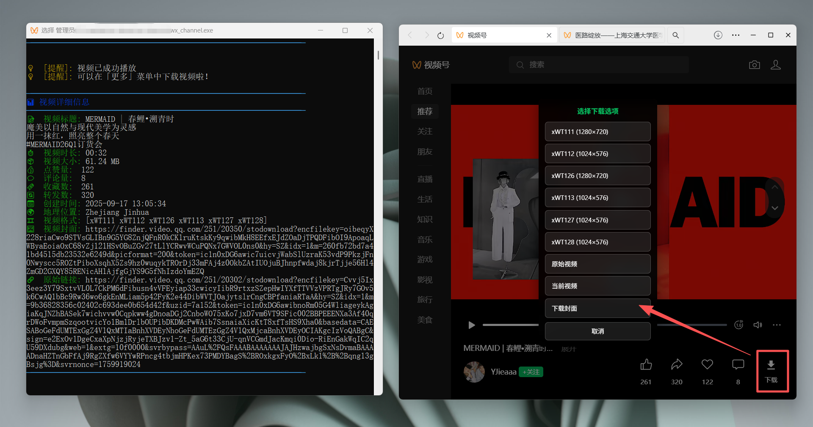
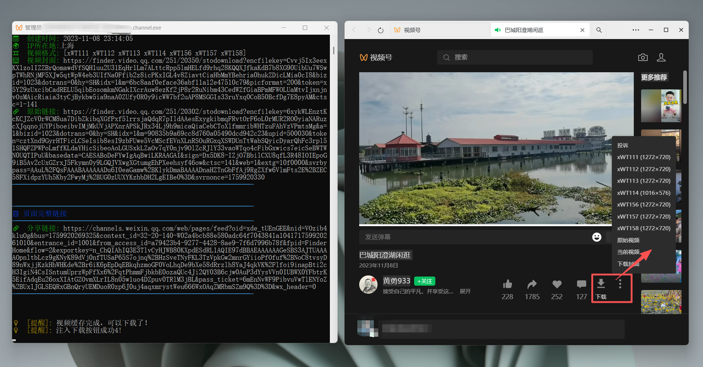

# 微信视频号下载工具

## 项目介绍

本项目是一个用于下载微信视频号内容的工具，基于[ltaoo的开源项目](https://github.com/ltaoo/wx_channels_download)进行功能扩展和界面优化。在此特别致敬原作者，感谢其开源贡献。


### 重要提醒：软件启动要用管理员权限，要安装证书才可以。

## 主要功能

- **✨ 首页下载支持**: 支持视频号首页直接下载，无需跳转详情页
- **🎨 统一样式**: Feed页和Home页下载按钮样式完全一致
- **⚡ 快速响应**: 优化按钮注入速度，减少等待时间
- **🔇 静默采集**: 首页自动采集视频数据，用户无感知
- **📊 完整数据**: 显示点赞、评论、收藏、转发等完整互动信息
- **🎯 智能识别**: 自动识别并记录视频作者昵称和地理位置
- **💾 数据导出**: 保存下载记录和运营数据为表格
- **🛠️ 清爽界面**: 优化调试输出，界面更简洁

## 使用指南

### 下载视频

#### 方式一：首页下载（推荐）
1. 打开微信视频号首页
2. 在视频下方操作栏中点击下载按钮



#### 方式二：详情页下载
1. 打开微信视频号中的视频详情页
2. 在视频下方操作栏中点击下载按钮（如下图所示）



> 注意：如果没有看到下载按钮，请检查「更多」选项中是否有「下载视频」。下载功能支持首页和详情页。

### 长视频下载

对于较长的视频，软件提供了缓存进度显示功能：

1. 视频加载过程中会显示缓存进度
   

2. 缓存完成后会有明显提示，此时可以进行下载
   

> 提示：长视频需要完整缓存后才能下载，建议按顺序缓存（不要跳着点进度条）

## 新增功能特性

### 🏠 首页下载支持
- **无需跳转**: 直接在视频号首页下载视频，无需进入详情页
- **自动采集**: 静默采集视频数据，用户完全无感知
- **统一样式**: 与详情页下载按钮样式完全一致

### 📊 完整数据展示
程序会自动显示以下视频信息：
- 📝 **视频标题** - 完整的视频描述
- 👤 **作者昵称** - 视频发布者信息
- 👍 **互动数据** - 点赞、评论、收藏、转发数量
- 🌍 **地理位置** - 视频发布的IP地址信息
- 🎬 **视频规格** - 分辨率、码率、时长等技术参数

### 🎯 智能识别功能
- **作者识别**: 自动从多个数据源获取作者昵称
- **位置识别**: 智能解析IP地址获取地理位置
- **数据去重**: 避免重复下载相同视频

## 视频格式参数对比

下表展示了不同视频格式的参数对比，可根据需求选择合适的格式：

|    文件名    |   分辨率   |  标识符  | 大小(MB) | 总比特率 | 帧速率 | 音频采样率 | 音频比特率 | 时长  |
| ------------ | ---------- | -------- | -------- | -------- | ------ | ---------- | ---------- | ----- |
| ..._WT112_1024x576.mp4 | 1024x576  | WT112    | 18.07    | 2116 Kbps | 30.000 fps | 44100 Hz   | 128 Kbps   | 71.61 秒 |
| ..._WT113_1024x576.mp4 | 1024x576  | WT113    | 14.13    | 1655 Kbps | 30.000 fps | 44100 Hz   | 128 Kbps   | 71.61 秒 |
| ..._WT114_1024x576.mp4 | 1024x576  | WT114    | 11.08    | 1298 Kbps | 30.000 fps | 44100 Hz   | 128 Kbps   | 71.61 秒 |
| ..._WT157_1024x576.mp4 | 1024x576  | WT157    | 14.37    | 1683 Kbps | 30.000 fps | 44100 Hz   | 128 Kbps   | 71.61 秒 |
| ..._WT158_1024x576.mp4 | 1024x576  | WT158    | 11.68    | 1368 Kbps | 30.000 fps | 44100 Hz   | 128 Kbps   | 71.61 秒 |
| ..._WT159_1024x576.mp4 | 1024x576  | WT159    | 9.44     | 1105 Kbps | 30.000 fps | 44100 Hz   | 128 Kbps   | 71.61 秒 |
| ..._WT111_1280x720.mp4 | 1280x720  | WT111    | 23.39    | 2740 Kbps | 30.000 fps | 44100 Hz   | 128 Kbps   | 71.61 秒 |
| ..._WT156_1280x720.mp4 | 1280x720  | WT156    | 18.44    | 2160 Kbps | 30.000 fps | 44100 Hz   | 128 Kbps   | 71.61 秒 |
| 原始视频              | 1920x1080 | 原始视频 | 130.04   | 15232 Kbps | 60.000 fps | 44100 Hz   | 128 Kbps   | 71.61 秒 |

## 版本更新历史

### v20251006 (最新版本)
- ✨ **新增首页视频下载支持** - 支持视频号首页直接下载
- 🎨 **统一下载按钮样式** - Feed页和Home页按钮样式完全一致
- ⚡ **优化按钮注入速度** - 减少按钮出现延迟，提升用户体验
- 🔇 **静默数据采集** - 首页自动采集视频数据，用户无感知
- 📊 **完善互动数据** - 显示点赞、评论、收藏、转发等完整信息
- 🎯 **智能作者识别** - 自动识别并记录视频作者昵称
- 🛠️ **优化调试输出** - 减少不必要的调试信息，界面更清爽

### V20250804版本
- 修复视频缓存功能及优化
- 修复下载按钮显示问题
- 新增保存页面代码功能（未开启，测试用）

### V20250703版本
- 小版本功能优化

### V20250623版本
- 增加程序图标，小部件美化
- 优化小功能
  
### v6.9
- 增加缓存提醒功能，长视频需要完整缓存才能下载
- 优化缓存进度显示

### v5.25
- 增加保存运营数据功能
- 支持导出公众号信息、视频发布IP、点赞、收藏、转发等数据

### v5.19
- 增加保存下载视频记录为表格功能

### v5.18
- 更改顶部文字"ltaoo v5"，致敬原作者
- 添加下载保存记录表格功能

## 常见问题解答

### 1. 服务启动后视频详情一直在加载，终端无日志
**解决方案**: 在终端中按一次 `Ctrl+C` 即可恢复正常。

### 2. 解密失败，停止下载
**解决方案**: 关闭所有视频页面和窗口，然后重新打开尝试下载。

### 3. 首页下载按钮没有出现
**解决方案**: 
- 确保在视频号首页（不是详情页）
- 等待1-2秒让按钮自动注入
- 如果仍未出现，尝试滑动到下一个视频再滑回来

### 4. 首页下载时提示"找不到视频"
**解决方案**: 
- 等待视频播放一段时间，让数据完全加载
- 或者切换到视频详情页进行下载

### 5. 下载记录中作者显示为空白
**解决方案**: 这是已知问题，程序会自动尝试从不同数据源获取作者信息，如果仍为空，可以手动记录。

## 开发指南

### 环境要求
- Go语言环境
- 管理员权限（用于网络请求拦截）

### 运行方式
以管理员身份启动终端，然后执行：
```bash
go run main.go
```

### 打包发布
```bash
# 基本打包
go build -o wx_channel.exe

# 优化体积的打包
go build -ldflags="-s -w" -o wx_channel_mini.exe
```

打包后可以使用 `upx` 压缩工具进一步减小体积：
```bash
upx --best wx_channel.exe
```

## 技术实现

本项目的核心实现基于以下技术：

1. **网络请求拦截** - 获取视频资源和元数据
2. **DOM动态注入** - 自定义界面元素添加下载按钮
3. **静默数据采集** - 无感知的视频数据获取
4. **视频流处理** - 缓存管理和解密功能
5. **智能数据解析** - 多源数据融合和去重
6. **数据导出** - 运营数据分析和表格生成

### 核心技术栈
- **代理拦截**: SunnyNet 网络请求拦截
- **前端注入**: JavaScript DOM 操作
- **数据采集**: Vuex Store 劫持
- **静默操作**: 键盘事件模拟
- **数据解析**: JSON 数据提取和格式化

### 参考项目
- [WechatVideoSniffer2.0](https://github.com/kanadeblisst00/WechatVideoSniffer2.0)
- [wx_channels_download](https://github.com/ltaoo/wx_channels_download)

### 核心依赖
- [SunnyNet](https://github.com/qtgolang/SunnyNet) - 网络请求拦截库

## 赞赏支持

如果本项目对您有所帮助，欢迎请作者喝杯咖啡 ☕️


感谢首位赞赏：潘*君的赞赏，谢谢你的支持，国庆新增了首页下载。

## 许可证

本项目遵循与原项目相同的开源许可证条款。
